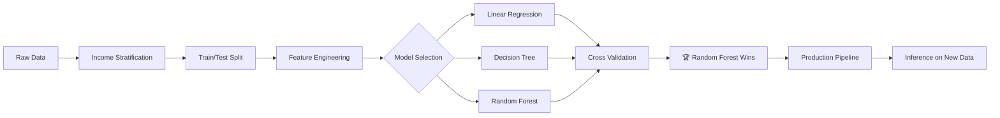

<div align="center">

# 🏠 Gurgaon Housing Price Predictor

### *Intelligent Real Estate Valuation Powered by Machine Learning*

[](https://python.org)
[](https://scikit-learn.org)
[](https://pandas.pydata.org)
[](https://numpy.org)
[](LICENSE)

<br/>

> **Predict residential property prices with confidence.**  
> A production-ready ML pipeline that trains, evaluates, and deploys a Random Forest model  
> achieving **18,269 RMSE** on training data — outperforming Linear Regression and Decision Trees.

<br/>

[Getting Started](#-getting-started) •
[How It Works](#-how-it-works) •
[Results](#-model-comparison--results) •
[Project Structure](#-project-structure) •
[Contributing](#-contributing)

---

</div>

## ✨ Highlights

| | Feature | Description |
|---|---|---|
| 🧠 | **Smart Preprocessing** | Automated pipeline with median imputation, standard scaling, and one-hot encoding |
| 📊 | **Rigorous Evaluation** | 10-fold stratified cross-validation with RMSE scoring |
| 🌲 | **Random Forest Champion** | Best generalization with lowest CV RMSE of **49,518** |
| 💾 | **Persistence** | Trained model and pipeline serialized via Joblib for instant inference |
| ⚡ | **One-Command Execution** | Single script handles training *and* inference seamlessly |

---

## 📋 Table of Contents

- [About the Project](#-about-the-project)
- [Dataset Overview](#-dataset-overview)
- [How It Works](#-how-it-works)
- [Model Comparison & Results](#-model-comparison--results)
- [Getting Started](#-getting-started)
- [Project Structure](#-project-structure)
- [Contributing](#-contributing)

---

## 🔍 About the Project

This project tackles the classic challenge of **predicting median house values** for residential districts using demographic and geographic features. The goal is to build a robust, production-ready ML pipeline that can:

1. **Train** on historical housing data with proper stratified sampling  
2. **Compare** multiple regression algorithms under fair evaluation  
3. **Deploy** the best model for real-time inference on new data  

The final system automatically detects whether a trained model exists — if not, it trains from scratch; otherwise, it runs inference on new input data and exports predictions.

---

## 📦 Dataset Overview

The dataset contains **20,640 residential districts** with the following features:

| Feature | Type | Description |
|---|---|---|
| `longitude` | Numerical | Geographic longitude coordinate |
| `latitude` | Numerical | Geographic latitude coordinate |
| `housing_median_age` | Numerical | Median age of houses in the district |
| `total_rooms` | Numerical | Total number of rooms in the district |
| `total_bedrooms` | Numerical | Total number of bedrooms in the district |
| `population` | Numerical | Total population of the district |
| `households` | Numerical | Total number of households |
| `median_income` | Numerical | Median income of district residents |
| `ocean_proximity` | Categorical | Proximity to the ocean (e.g., NEAR BAY, INLAND) |
| **`median_house_value`** | **Target** | **Median house value (prediction target)** |

> **Stratified Sampling:** The dataset is split 80/20 using stratified shuffle splitting based on income categories to ensure representative train/test distributions.

---

## ⚙️ How It Works

```
┌─────────────────────────────────────────────────────────────────────┐
│                        🏗️  TRAINING PHASE                          │
│                                                                     │
│   housing_dataset.csv                                               │
│         │                                                           │
│         ▼                                                           │
│   ┌───────────────┐    ┌──────────────────────────────────────┐     │
│   │  Stratified    │    │      Preprocessing Pipeline         │     │
│   │  Train/Test    │───▶│  ┌────────────┐  ┌───────────────┐  │     │
│   │  Split (80/20) │    │  │  Numerical  │  │ Categorical   │  │     │
│   └───────────────┘    │  │ ┌─────────┐ │  │ ┌───────────┐ │  │     │
│                         │  │ │ Imputer │ │  │ │ OneHot    │ │  │     │
│                         │  │ │(median) │ │  │ │ Encoder   │ │  │     │
│                         │  │ ├─────────┤ │  │ └───────────┘ │  │     │
│                         │  │ │ Std     │ │  └───────────────┘  │     │
│                         │  │ │ Scaler  │ │                     │     │
│                         │  │ └─────────┘ │                     │     │
│                         │  └────────────┘                      │     │
│                         └──────────────────────────────────────┘     │
│                                    │                                │
│                                    ▼                                │
│                         ┌──────────────────┐                        │
│                         │  Random Forest   │                        │
│                         │  Regressor       │──▶ model.pkl           │
│                         └──────────────────┘    pipeline.pkl        │
│                                                                     │
└─────────────────────────────────────────────────────────────────────┘

┌─────────────────────────────────────────────────────────────────────┐
│                       🔮  INFERENCE PHASE                           │
│                                                                     │
│   input.csv ──▶ pipeline.pkl ──▶ model.pkl ──▶ output.csv          │
│                                                                     │
└─────────────────────────────────────────────────────────────────────┘
```

### Pipeline Components

| Stage | Component | Details |
|---|---|---|
| 1️⃣ | **Data Ingestion** | Load CSV, create income-based strata |
| 2️⃣ | **Stratified Split** | 80/20 split preserving income distribution |
| 3️⃣ | **Numerical Pipeline** | `SimpleImputer(median)` → `StandardScaler` |
| 4️⃣ | **Categorical Pipeline** | `OneHotEncoder(handle_unknown='ignore')` |
| 5️⃣ | **Model Training** | `RandomForestRegressor(random_state=42)` |
| 6️⃣ | **Serialization** | Joblib persistence for model + pipeline |

---

## 📈 Model Comparison & Results

Three regression models were trained and evaluated using **10-fold cross-validation** with negative RMSE scoring:

### Training Performance

| Model | Training RMSE | Verdict |
|:---|:---:|:---|
| 🔵 Linear Regression | `69,050.56` | High bias — underfitting the data |
| 🟠 Decision Tree | `0.00` | ⚠️ Zero error = **severe overfitting** |
| 🟢 Random Forest | `18,269.91` | ✅ Low error with good generalization |

### Cross-Validation Results (10-Fold)

<table>
<tr>
<th></th>
<th>🔵 Linear Regression</th>
<th>🟠 Decision Tree</th>
<th>🟢 Random Forest</th>
</tr>
<tr><td><b>Mean RMSE</b></td><td>69,204.32</td><td>68,788.97</td><td><b>49,518.42 ✅</b></td></tr>
<tr><td><b>Std Dev</b></td><td>2,500.38</td><td>2,353.97</td><td><b>2,122.95</b></td></tr>
<tr><td><b>Min</b></td><td>65,318.22</td><td>65,491.29</td><td><b>46,485.85</b></td></tr>
<tr><td><b>25%</b></td><td>67,124.35</td><td>66,990.03</td><td><b>47,863.35</b></td></tr>
<tr><td><b>Median</b></td><td>69,404.66</td><td>68,940.28</td><td><b>49,204.48</b></td></tr>
<tr><td><b>75%</b></td><td>70,697.80</td><td>69,629.10</td><td><b>50,793.42</b></td></tr>
<tr><td><b>Max</b></td><td>73,003.75</td><td>73,159.40</td><td><b>53,407.18</b></td></tr>
</table>

### 🏆 Winner: Random Forest

```
📉 Training RMSE:  18,269  (vs 69,050 for Linear Regression)
📊 CV RMSE:        49,518  (vs 69,204 for Linear Regression)  
📐 CV Std Dev:      2,122  (most stable across folds)
🎯 Improvement:      ~28%  reduction in CV RMSE vs baselines
```

> **Key Insight:** While the Decision Tree memorized training data perfectly (0.0 RMSE), its cross-validation RMSE (68,789) reveals catastrophic overfitting. The Random Forest's ensemble approach regularizes this behavior, achieving the best balance between fitting the training data and generalizing to unseen examples.

---

## 🚀 Getting Started

### Prerequisites

- Python **3.10+**
- pip or conda package manager

### Installation

```bash
# 1. Clone the repository
git clone https://github.com/your-username/gurgaon-housing-price-predictor.git
cd gurgaon-housing-price-predictor

# 2. Create a virtual environment (recommended)
python -m venv venv
source venv/bin/activate  # On Windows: venv\Scripts\activate

# 3. Install dependencies
pip install pandas numpy scikit-learn joblib
```

### Usage

```bash
# First run — trains the model from scratch
python main.py
# Output: "model is trained .congrats"

# Subsequent runs — performs inference on input.csv
python main.py
# Output: "Inference is complete, results saves to output.csv Enjoy!"
```

#### Run Model Comparison Experiments

```bash
# Compare all three models with cross-validation
python main_old.py
```

---

## 📁 Project Structure

```
gurgaon-housing-price-predictor/
│
├── 📄 main.py               # Production pipeline (train + inference)
├── 📄 main_old.py            # Model comparison experiments
│
├── 📊 housing_dataset.csv    # Raw dataset (20,640 records)
├── 📥 input.csv              # Test/inference input data
├── 📤 output.csv             # Prediction results
│
├── 🧠 model.pkl              # Trained Random Forest model
├── ⚙️ pipeline.pkl            # Fitted preprocessing pipeline
│
└── 📄 README.md              # You are here!
```

---

## 🧪 Methodology



---

## 🛠️ Tech Stack

<div align="center">

| Technology | Purpose |
|:---:|:---:|
|  | Core language |
|  | Data manipulation |
|  | Numerical computing |
|  | ML models & pipelines |
|  | Model serialization |

</div>

---

## 🤝 Contributing

Contributions are welcome! Here's how you can help:

1. 🍴 **Fork** the repository  
2. 🌿 **Create** a feature branch (`git checkout -b feature/amazing-feature`)  
3. 💾 **Commit** your changes (`git commit -m 'Add amazing feature'`)  
4. 📤 **Push** to the branch (`git push origin feature/amazing-feature`)  
5. 🔃 **Open** a Pull Request  

### Ideas for Improvement

- [ ] Add hyperparameter tuning with `GridSearchCV` or `RandomizedSearchCV`
- [ ] Implement feature engineering (e.g., rooms per household, bedrooms ratio)
- [ ] Add XGBoost and Gradient Boosting models to the comparison
- [ ] Build a Streamlit/Flask web interface for interactive predictions
- [ ] Add geographical visualization of predictions on a map

---

## 📜 License

This project is licensed under the **MIT License** — see the [LICENSE](LICENSE) file for details.

---

<div align="center">

**⭐ If you found this project useful, please consider giving it a star!**

Made with ❤️ and Python

</div>
